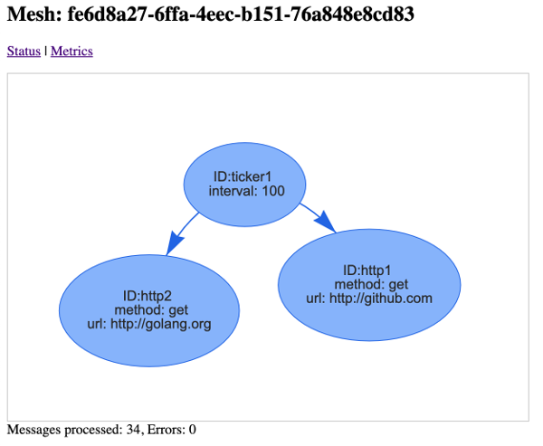

# Mesh: Meta Broker

[](http://www.apache.org/licenses/LICENSE-2.0)
[](https://travis-ci.com/pbudzik/mesh)

## What is it?

* Cross-protol bridge/proxy/converter
* Event router
* Meta Broker
* Side-car proxy

## What problem does it solve?

In the messaging/eventing space multiple protocols exist and will exist. Rather than rewriting applications to support newer technologies, it's often more suitable to integrate existing applications so that they can talk to each other. While integrating A with B seems to be an easy task, when there are many points to communicate it all gets more complex. 

Mesh tries to provide a light, configurable and extensible "messaging side-car proxy". 

Exemplary use case:

An (old) app publishes events to some legacy system using http (post). There is a new system using Kafka it's supposed to integrate with. One option would be integrate with Kafka, but that may be a) needing investment b) tech stack may not be compatible. Solution: setup a Mesh proxy that mimics the old system (consumes same HTTP post requests), but redelivers them to Kafka.

## Benefits

* Async events across different protocols
* Lightweight, fast
* Exensible via Javascript handlers
* Metrics (Prometheus)
* Throttling, retries, timeouts
* Web console
* Linux/Mac/Windows (single executable)
* Docker support

## Protocols

- HTTP
- Kafka
- AMQP 1.0
- MQTT
- Websockets

## Usage

### Standalone

    make dist
    dist/.../mesh -f yaml_file -p port

### Docker
    
    make docker
    docker run -v mesh/examples/http-http.yaml:/root/test.yaml \
    -p 8080:8080 -p 9111:9111 -it mesh -f /root/test.yaml 

## Mesh file

Sample HTTP->Kafka mesh:

```yaml
version: v1
consumers:
  - id: foo #creates a listener at 8081/foo
    type: http # component type
    rate: 1 # throttling at 1 TPS 
    details: #details of underlying protocol
      port: 8081
      uri: /foo
producers:
  - id: bar
    type: kafka
    timeout: 1000 # 1 second
    details:
      brokers: 0.0.0.0:9092 #comma separated list
      topic: my_topic #topic to write to
mesh: # actual mesh, consumers/producers referenced by id's
  - in: foo # consumer 
    out: # producers
      - bar
```
Sample Kafka->MQTT mesh with JS handlers

```yaml
version: v1
consumers:
    - id: kafka1
    type: kafka
    details:
      brokers: 0.0.0.0:9092 #comma separated list
      topic: my_topic # topic to subscribe
producers:
  - id: mqtt1
    type: mqtt
    filter: function filter() {if (headers['foo']=='bar') {return true} else {return false}} # inline JS or file name
    process: function process() { headers['baz']='I was here'; } # body and headers are global in scope of transaction
    details:
      url: tcp://localhost:1883
      topic: my_topic # topic to write to
mesh:
  - in: kafka1
    out:
      - mqtt1
```

### Dashboard

http://localhost:8080

Sample screenshot:

 

### Metrics

Prometheus metrics can be seen/scraped from: http://localhost:8080/metrics

## Design

### Messsage  

Abstraction of a cross-protocol event. Consists of:

* Data - array of bytes
* Headers - map string -> array of bytes 

### Consumers and producers

Consumer - component that receives events from external source and hands them off to producers

Producer - component that receives events from consumers and produces external events

Event (aka Message) can be sent to multiple producers. The send is parallel and async.

### Mesh

Topology of interconnected consumers and producers. 

### Scripting

Both consumers and producers can be extended by two handlers (Javascript functions):

1. Filter - filter() -> boolean, result can determine if an event should be processed or dropped.
2. Process - process(), message can be altered (addition, decoration etc) prior to the actual processing.

Definition can be provided as inlined JS or as a reference to file.

## Components

| Component      | Protocol       | Notes  |
| ------------- |:-------------| -----|
|http|HTTP,HTTPS| |
|kafka|Kafka| |
|amqp|AMQP 1.0| |
|mqtt|MQTT| |
|http|HTTP,HTTPS| |
|websockets|WebSockets|
|ticker|N/A|Triggering time based events. Consumer only.| 
|std| N/A|Consumer reads data from stdin. Producer writes to stdout.|

### HTTP

#### Consumer 

HTTP body -> Message.Data

HTTP headers -> Message.Headers

#### Producer

Message.Data -> HTTP body

Message.Headers -> HTTP headers

### Kafka

#### Consumer

Message key -> Message.Headers["kafka_key"]

Message data -> Message.Data 

#### Producer

Message.Headers["kafka_key"] -> Kafka Message Key

Message.Data -> Kafka Message 

### AMQP 1.0

TBD

### MQTT

TBD

### Websockets

TBD 

## Security

TBD

## Contributing

There is a whole lot to do. If you want to help me, you are welcome. Please fork the repo, create a pull request against master, and be sure tests pass. 