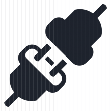

# Mesh: Meta Broker

## What is it?

* EventMesh
* Trans-protocol converter
* Inter-protol bridge/proxy
* Meta Broker

## Features

* async only
* lightweight, fast
* throttling
* metrics: prometheus
* js support
* web console
* Linux/Mac/Windows (single executable)
* Docker

## Protocols

- HTTP
- Kafka
- AMQP 1.0
- MQTT
- Websockets

## Messsage model 

* Data - array of bytes
* Headers - map string -> array of bytes 

| Protocol      | Message       | Headers  |
| ------------- |:-------------:| -----:|
|1|1|1

| Component      | Protocol       | Notes  |
| ------------- |:-------------| -----|
|http|HTTP,HTTPS| |
|kafka|Kafka| |
|amqp|AMQP 1.0| |
|mqtt|MQTT| |
|http|HTTP,HTTPS| |
|websockets|WebSockets|
|ticker|N/A|Triggering time based events. Consumer only.| 
|std| N/A|Consumer reads data from stdin. Producer writes to stdout.|

{:height="36px" width="36px"}

## Components

### HTTP

#### Consumer 

HTTP body -> Message.Data

HTTP headers -> Message.Headers

#### Producer

Message.Data -> HTTP body

Message.Headers -> HTTP headers

### Kafka

#### Consumer

Message key -> Message.Headers["kafka_key"]

Message data -> Message.Data 

#### Producer

Message.Headers["kafka_key"] -> Kafka Message Key

Message.Data -> Kafka Message 

### AMQP 1.0

### MQTT

### Websockets

## Security

## Contributing

There is a whole lot to do. If you want to help me, you are welcome. Please fork the repo, create a pull request against master, and be sure tests pass. 